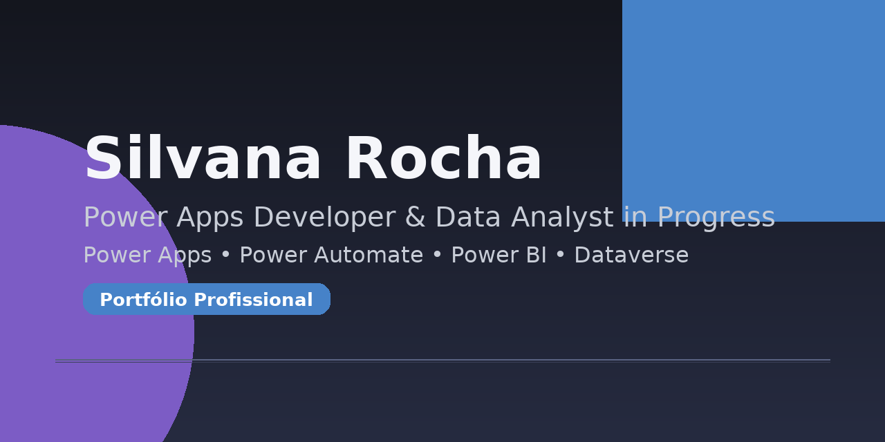

<p align="center">
  
</p>

<h1 align="center">🌟 Silvana Rocha</h1>
<p align="center"><b>Power Apps Developer & Data Analyst in Progress</b></p>

<p align="center">
  
</p>

<p align="center"><i>Transformando ideias em soluções reais com Power Platform &amp; Dados.</i></p>

---

## 🎓 Certificações Microsoft

**Concluídas:**  
- ✅ AZ-900 – Azure Fundamentals  
- ✅ PL-900 – Power Platform Fundamentals  
- ✅ MS-900 – Microsoft 365 Fundamentals  
- ✅ IA-900 – AI Fundamentals  
- ✅ DP-900 – Data Fundamentals  

**Em andamento / agendadas:**  
- 🛡️ SC-900 – Security (Prova: 22/10)  
- 🎨 PL-200 – Power Apps (Em estudo)  
- 📊 PL-300 – Power BI Data Analyst (Em estudo)  
- 🤖 GitHub Copilot (Em preparação)  
- 💻 PL-400 – Power Platform Developer (Meta futura)

---

## 🛠 Tecnologias & Ferramentas

- 💜 **Power Platform:** Power Apps | Power Automate | Power BI  
- 📊 **Dados e BI:** Power Query | DAX | Dashboards  
- 🗂 **Integrações:** SharePoint | Dataverse | Excel | APIs  
- 🤖 **IA e Produtividade:** GitHub Copilot | Microsoft 365  
- 📁 **Versionamento:** GitHub

---

## 📂 Estrutura do Portfólio

```
portfolio-powerplatform/
├─ powerapps/
│  ├─ app-staffing/
│  ├─ app-financeiro/
│  └─ app-tarefas/
├─ powerbi/
│  ├─ dashboard-staffing/
│  └─ dashboard-financeiro/
├─ automations/
└─ certifications/
```

- `powerapps/` — Apps Canvas/Model-Driven (prints, fórmulas, integrações)  
- `powerbi/` — Dashboards (PBIX*, prints, DAX, modelagem)  
- `automations/` — Fluxos Power Automate (prints + descrição)  
- `certifications/` — Estudos e anotações (PL-200, PL-300, SC-900, Copilot, PL-400)

> *Dica:* se não quiser subir PBIX, publique prints + DAX principais.

---

## 🧭 Projetos em Destaque (em construção)

- **App Staffing (Power Apps + SharePoint):** gestão de FTE, custos e alocação  
- **App Financeiro (Power Apps):** clientes, custos e aprovações  
- **Dashboard Staffing (Power BI):** KPIs operacionais (FTE, DCSO, horas, custos)

Cada pasta de projeto contém: _descrição_, _prints_, _decisões técnicas_ e _próximos passos_.

---

## 🌱 Objetivo Profissional

> Evoluir como **Power Platform & Data Professional**, unindo desenvolvimento de apps, automação e análise de dados para gerar impacto real no negócio.

---

## 📫 Contato

- GitHub: https://github.com/silvanatereza  
- LinkedIn: *(em atualização com a nova identidade)*

---

<p align="center">
  <sub>© 2025 Silvana Rocha — Portfólio Profissional (MIT License)</sub>
</p>
